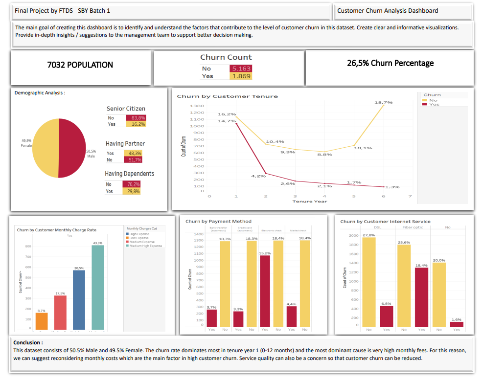

<!--  -->

# Customer Churn Detection and Segmentation
The telecommunications industry, being highly competitive, faces challenges in retaining customers. Churn, or customer attrition, is a critical metric that directly impacts the revenue and growth of a Telco company.

## Project Overview
The primary goal of this project is to analyze and understand the factors contributing to customer churn in a Telco company, enabling data-driven strategies to reduce churn rates and enhance customer retention.
## Tools and Technologies
- Python
- Jupyter Notebook
- Pandas
- Matplotlib
- Seaborn
- Scikit-learn

## File Description
- `airflow_DAG.py` : Airflow DAGs containing the code to extract data from database, perform data cleaning and save clean data.
- `data_analyst.ipynb` : Jupyter Notebook containing the code for data exploration and visualization.
- `data_scientist.ipynb` : Jupyter Notebook containing the code for modeling.
- `telco_data_raw.csv` : CSV file containing the raw data of Telco Customer transaction.
- `telco_data_clean.csv` : CSV file containing the clean data of Telco Customer transaction.
- `images/` : Folder containing data visualization and analysis result.

## Exploratory Data Analysis
---

## Conclusion
Based on the Exploratory Data Analysis we found 3 cluster of customer churn. All three clusters show similarities in having a short average tenure, indicating a trend for customers to end service relatively quickly. Fiber optic internet service was a common factor among the clusters, indicating that this service may have issues that lead to customer dissatisfaction.

## Suggestion
- Always improve service quality and maintain open communication with customers.
- Consider a loyalty program or incentives for loyal customers.
- Monitor and respond to customer feedback regularly.
- Adjust marketing strategies and offers based on the characteristics of each cluster.
- Strengthen customer service to provide effective and responsive support.

## Acknowledgements
The Telco Transaction data used in this project was obtained from [Kaggle](https://www.kaggle.com/datasets/blastchar/telco-customer-churn/)
